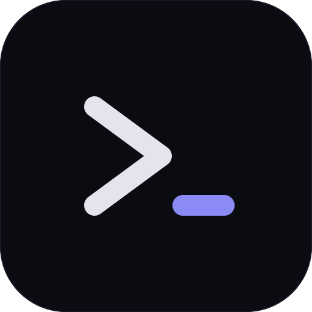

# VoidTerm

<p align="center">
  
</p>

<p align="center">
  <strong>Modern, hızlı ve çapraz platform terminal emülatörü</strong>
</p>

<p align="center">
  <a href="https://github.com/bqrayvzdgn/VoidTerm/releases/latest"></a>
  <a href="https://github.com/bqrayvzdgn/VoidTerm/blob/main/LICENSE"></a>
  <a href="https://github.com/bqrayvzdgn/VoidTerm/releases"></a>
</p>

<p align="center">
  <a href="#özellikler">Özellikler</a> •
  <a href="#kurulum">Kurulum</a> •
  <a href="#geliştirme">Geliştirme</a> •
  <a href="#klavye-kısayolları">Kısayollar</a> •
  <a href="#temalar">Temalar</a> •
  <a href="#yapılandırma">Yapılandırma</a>
</p>

---

## 🚀 Özellikler

### Temel Özellikler
- **⚡ Hızlı Performans** - WebGL tabanlı render engine ile yüksek performanslı terminal deneyimi
- **🎨 Zengin Tema Desteği** - 6 yerleşik tema + özel tema oluşturma desteği
- **📑 Sekme ve Panel Yönetimi** - Çoklu sekmeler ve dikey/yatay bölünmüş paneller
- **🔧 Özelleştirilebilir Profiller** - Farklı shell'ler için ayrı profil yapılandırmaları
- **💼 Workspace Desteği** - Çalışma alanlarınızı gruplandırın ve yönetin
- **🖥️ Çapraz Platform** - Windows, macOS ve Linux desteği
- **🌐 Çoklu Dil** - Türkçe ve İngilizce arayüz desteği

### Gelişmiş Özellikler
- **🔌 SSH Bağlantıları** - SSH sunucularına doğrudan bağlantı ve kayıtlı bağlantı yönetimi
- **📝 Kod Parçacıkları (Snippets)** - Sık kullanılan komutları kaydedin ve tek tıkla çalıştırın
- **📢 Broadcast Modu** - Aynı anda tüm terminallere komut gönderin
- **🔍 Terminal İçi Arama** - Ctrl+F ile terminal çıktısında arama (geçmiş desteği ile)
- **💾 Yapılandırma Yedekleme** - Ayarlarınızı yedekleyin ve geri yükleyin
- **🔄 Otomatik Güncelleme** - Yeni sürümler için otomatik güncelleme desteği

### Stabilite ve Performans
- **🛡️ PTY Cleanup** - Renderer crash durumunda orphan process temizleme
- **⏱️ Resize Debouncing** - Optimize edilmiş pencere boyutlandırma
- **📊 Structured Logging** - Detaylı hata ayıklama için yapılandırılmış log sistemi

## 📦 Kurulum

### Hazır Sürümler

[Releases](https://github.com/bqrayvzdgn/VoidTerm/releases) sayfasından işletim sisteminize uygun kurulum dosyasını indirin:

| Platform | Format |
|----------|--------|
| Windows  | `.exe` (NSIS Installer) |
| macOS    | `.dmg` |
| Linux    | `.AppImage`, `.deb` |

### Kaynak Koddan Derleme

```bash
# Repoyu klonlayın
git clone https://github.com/bqrayvzdgn/VoidTerm.git
cd VoidTerm

# Bağımlılıkları yükleyin
npm install

# Geliştirme modunda çalıştırın
npm run dev

# Production build oluşturun
npm run build
```

#### Platforma Özel Build

```bash
# Windows
npm run build:win

# macOS
npm run build:mac

# Linux
npm run build:linux
```

## 🛠️ Geliştirme

### Gereksinimler

- Node.js 18+
- npm veya yarn
- Git

### Proje Yapısı

```
VoidTerm/
├── electron/           # Electron ana süreç kodları
│   ├── main.ts         # Pencere ve IPC yönetimi
│   ├── pty-manager.ts  # Terminal süreç yönetimi (node-pty)
│   ├── config-manager.ts # Yapılandırma ve yedekleme yönetimi
│   ├── logger.ts       # Structured logging (electron-log)
│   └── preload.ts      # Renderer API köprüsü
├── src/                # React renderer süreci
│   ├── components/     # React bileşenleri
│   ├── store/          # Zustand state yönetimi
│   ├── themes/         # Terminal temaları
│   ├── hooks/          # Custom React hooks
│   ├── i18n/           # Çoklu dil desteği (tr/en)
│   ├── utils/          # Yardımcı fonksiyonlar ve logger
│   └── types/          # TypeScript tip tanımları
├── e2e/                # End-to-end testler (Playwright)
├── assets/             # İkonlar ve statik dosyalar
└── scripts/            # Build yardımcı scriptleri
```

### Teknoloji Yığını

| Katman | Teknoloji |
|--------|-----------|
| Framework | Electron 28 |
| UI | React 18 |
| Bundler | Vite 5 |
| Terminal | xterm.js 6 + WebGL |
| PTY | node-pty |
| State | Zustand |
| Config | electron-store |
| Logging | electron-log |
| i18n | Custom implementation |
| Testing | Vitest + Playwright |
| Language | TypeScript 5 |

### Geliştirme Komutları

```bash
# Geliştirme sunucusu (Vite + Electron)
npm run dev

# Sadece Electron kodlarını derle
npm run build:electron

# Unit testleri çalıştır
npm run test

# Test izleme modu
npm run test:watch

# E2E testleri çalıştır
npm run test:e2e

# İkon oluştur
npm run generate-icons
```

## ⌨️ Klavye Kısayolları

### Sekme ve Panel Yönetimi

| Kısayol | İşlev |
|---------|-------|
| `Ctrl+T` / `Cmd+T` | Yeni sekme |
| `Ctrl+W` / `Cmd+W` | Sekmeyi kapat |
| `Ctrl+Tab` | Sonraki sekme |
| `Ctrl+Shift+Tab` | Önceki sekme |
| `Ctrl+Shift+T` | Kapatılan sekmeyi yeniden aç |
| `Ctrl+Shift+D` | Dikey bölme |
| `Ctrl+Shift+E` | Yatay bölme |
| `Ctrl+Shift+W` | Paneli kapat |

### Navigasyon

| Kısayol | İşlev |
|---------|-------|
| `Ctrl+Alt+↑/↓/←/→` | Paneller arası geçiş |
| `Ctrl+Shift+M` | Paneli maksimize et/küçült |

### Terminal İşlemleri

| Kısayol | İşlev |
|---------|-------|
| `Ctrl+Shift+C` | Kopyala |
| `Ctrl+Shift+V` | Yapıştır |
| `Ctrl+F` | Terminal içi arama |
| `Ctrl+L` | Terminal temizle |
| `Ctrl++` / `Ctrl+=` | Yakınlaştır |
| `Ctrl+-` | Uzaklaştır |
| `Ctrl+0` | Zoom sıfırla |

### Uygulama

| Kısayol | İşlev |
|---------|-------|
| `Ctrl+,` / `Cmd+,` | Ayarlar |
| `Ctrl+Shift+P` | Komut paleti |
| `Ctrl+Shift+S` | SSH yöneticisi |
| `Ctrl+B` | Workspace sidebar aç/kapat |

> **Not:** Tüm klavye kısayolları Ayarlar > Kısayollar bölümünden özelleştirilebilir.

## 🎨 Temalar

VoidTerm aşağıdaki yerleşik temalarla birlikte gelir:

- **Catppuccin Mocha** (varsayılan) - Yumuşak, pastel tonlarda karanlık tema
- **Dracula** - Popüler mor tonlu karanlık tema
- **One Dark** - Atom editöründen ilham alan tema
- **Tokyo Night** - Tokyo gece manzarasından ilham alan tema
- **Nord** - Arktik, mavi tonlu tema
- **GitHub Dark** - GitHub'ın karanlık teması

### Özel Tema Oluşturma

Ayarlar > Temalar bölümünden kendi özel temanızı oluşturabilirsiniz. 16 renk paleti, imleç rengi ve seçim rengi özelleştirilebilir.

## ⚙️ Yapılandırma

Yapılandırma dosyası platforma göre şu konumlarda saklanır:

| Platform | Konum |
|----------|-------|
| Windows  | `%APPDATA%/voidterm/config.json` |
| macOS    | `~/Library/Application Support/voidterm/config.json` |
| Linux    | `~/.config/voidterm/config.json` |

### Profil Yapılandırması

Her profil için aşağıdaki ayarlar yapılandırılabilir:

- Shell yolu ve argümanları
- Çalışma dizini
- Ortam değişkenleri
- Başlangıç komutu
- İkon ve renk

### Yedekleme ve Geri Yükleme

Ayarlar > Yedekleme bölümünden:
- Manuel yedek oluşturabilirsiniz
- Önceki yedekleri görüntüleyebilir ve geri yükleyebilirsiniz
- Yapılandırmayı dışa/içe aktarabilirsiniz

> **Not:** Sistem otomatik olarak geri yükleme öncesinde mevcut yapılandırmanın yedeğini alır.

## 🏗️ Mimari

### Süreç Ayrımı

VoidTerm, Electron'un çift süreç mimarisini kullanır:

**Ana Süreç (Main Process)**
- Pencere yönetimi
- PTY (pseudo-terminal) işlemleri
- Yapılandırma ve yedekleme yönetimi
- Sistem menüleri
- Otomatik güncelleme

**Renderer Süreci**
- React tabanlı kullanıcı arayüzü
- xterm.js ile terminal görüntüleme
- Zustand ile state yönetimi

### IPC İletişimi

Renderer süreci, `window.electronAPI` üzerinden ana süreç ile iletişim kurar:

```typescript
// Terminal oluşturma
const ptyId = await window.electronAPI.ptyCreate({ shell, cwd, env })

// Veri gönderme
window.electronAPI.ptyWrite(ptyId, data)

// Veri alma
window.electronAPI.onPtyData((id, data) => { ... })

// Yapılandırma
const settings = await window.electronAPI.config.getSettings()
```

## 📄 Lisans

Bu proje [MIT Lisansı](LICENSE) altında lisanslanmıştır.

## 🤝 Katkıda Bulunma

Katkılarınızı bekliyoruz! Lütfen bir Pull Request göndermeden önce:

1. Projeyi fork edin
2. Feature branch oluşturun (`git checkout -b feature/amazing-feature`)
3. Değişikliklerinizi commit edin (`git commit -m 'feat: Add amazing feature'`)
4. Branch'inizi push edin (`git push origin feature/amazing-feature`)
5. Pull Request açın

### Geliştirme Kuralları

- Kod stili için [CLAUDE.md](CLAUDE.md) dosyasını inceleyin
- Yeni özellikler için test yazmayı unutmayın
- Commit mesajlarında [Conventional Commits](https://www.conventionalcommits.org/) kullanın

## 📞 İletişim

- **Issues**: [GitHub Issues](https://github.com/bqrayvzdgn/VoidTerm/issues)

---

<p align="center">
  Made with ❤️ by Bqrayvzdgn
</p>
