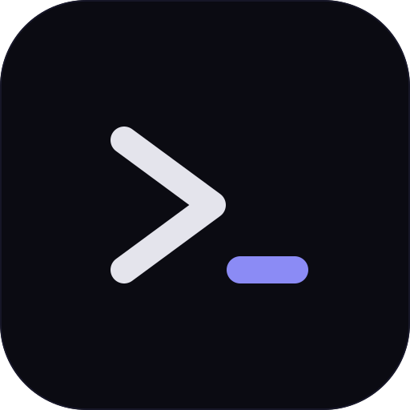

# VoidTerm

<p align="center">
  
</p>

<p align="center">
  <a href="https://github.com/bqrayvzdgn/VoidTerm/actions/workflows/ci.yml"></a>
  <a href="https://github.com/bqrayvzdgn/VoidTerm/releases/latest"></a>
  <a href="https://github.com/bqrayvzdgn/VoidTerm/blob/main/LICENSE"></a>
  <a href="https://github.com/bqrayvzdgn/VoidTerm/releases"></a>
</p>

<p align="center">
  <a href="#english">English</a> •
  <a href="#türkçe">Türkçe</a>
</p>

---

# English

<p align="center">
  <strong>Modern, fast, cross-platform terminal emulator</strong>
</p>

<p align="center">
  <a href="#features">Features</a> •
  <a href="#installation">Installation</a> •
  <a href="#development">Development</a> •
  <a href="#keyboard-shortcuts">Shortcuts</a> •
  <a href="#themes">Themes</a> •
  <a href="#configuration">Configuration</a>
</p>

## Features

### Core Features

- **Fast Performance** - WebGL-based render engine for high-performance terminal experience
- **Rich Theme Support** - 14 built-in themes + custom theme creation
- **Tabs & Panes** - Multiple tabs and vertical/horizontal split panes
- **Customizable Profiles** - Separate profile configurations for different shells
- **Workspace Support** - Group and manage your workspaces
- **Cross-Platform** - Windows, macOS, and Linux support

### Advanced Features

- **SSH Connections** - Direct SSH server connections and saved connection management
- **In-Terminal Search** - Search terminal output with Ctrl+F (regex and case-sensitive modes, with history support)
- **Status Bar** - Shell info, CWD, and vi mode indicators
- **Auto-Update** - Automatic update support for new versions

### Security & Stability

- **Environment Whitelist** - Only safe environment variables are passed to terminal processes
- **SSH Input Validation** - Connection parameters are sanitized before saving
- **Error Boundaries** - Granular error isolation for terminal and panel components
- **PTY Cleanup** - Orphan process cleanup on renderer crash
- **Resize Debouncing** - Optimized window resizing
- **Structured Logging** - Context-aware structured log system for detailed debugging

## Installation

### Ready-Made Releases

Download the installer for your operating system from the [Releases](https://github.com/bqrayvzdgn/VoidTerm/releases) page.

| Platform | Format |
|----------|--------|
| Windows  | `.exe` (NSIS Installer) |
| macOS    | `.dmg` |
| Linux    | `.AppImage`, `.deb` |

### Build from Source

```bash
# Clone the repo
git clone https://github.com/bqrayvzdgn/VoidTerm.git
cd VoidTerm

# Install dependencies
npm install

# Run in development mode
npm run dev

# Create production build
npm run build
```

#### Platform-Specific Build

```bash
# Windows
npm run build:win

# macOS
npm run build:mac

# Linux
npm run build:linux
```

## Development

### Requirements

- Node.js 18+
- npm or yarn
- Git

### Project Structure

```
VoidTerm/
├── electron/           # Electron main process
│   ├── main.ts         # Window and IPC management
│   ├── pty-manager.ts  # Terminal process management (env whitelist)
│   ├── config-manager.ts # Config management
│   ├── auto-updater.ts # Auto-update with lazy loading
│   ├── logger.ts       # Structured logging
│   └── preload.ts      # Renderer API bridge
├── src/                # React renderer process
│   ├── components/     # React components (ErrorBoundary, SSH, Terminal)
│   ├── store/          # Zustand state management
│   ├── themes/         # Terminal themes
│   ├── hooks/          # Custom React hooks
│   ├── utils/          # Utility functions (validation, logger)
│   └── types/          # TypeScript type definitions
├── e2e/                # Playwright E2E tests
├── assets/             # Icons and static files
└── scripts/            # Build and launch scripts
```

### Tech Stack

| Layer | Technology |
|-------|------------|
| Framework | Electron 28 |
| UI | React 18 |
| Bundler | Vite 5 |
| Terminal | xterm.js 6 + WebGL |
| PTY | node-pty |
| State | Zustand |
| Config | electron-store |
| Logging | electron-log |
| Testing | Vitest + Playwright |
| Language | TypeScript 5 |

### Development Commands

```bash
# Development server
npm run dev

# Build Electron code only
npm run build:electron

# Run unit tests
npm run test

# Run tests in watch mode
npm run test:watch

# Run E2E tests
npm run test:e2e
```

## Keyboard Shortcuts

### Tab & Pane Management

| Shortcut | Action |
|----------|--------|
| `Ctrl+T` / `Cmd+T` | New tab |
| `Ctrl+W` / `Cmd+W` | Close tab |
| `Ctrl+Tab` | Next tab |
| `Ctrl+Shift+Tab` | Previous tab |
| `Ctrl+Shift+T` | Reopen closed tab |
| `Ctrl+Shift+D` | Split vertical |
| `Ctrl+Shift+E` | Split horizontal |
| `Ctrl+Shift+W` | Close pane |
| `Ctrl+Shift+M` | Maximize/minimize pane |

### Navigation

| Shortcut | Action |
|----------|--------|
| `Alt+↑/↓/←/→` | Navigate between panes |

### Terminal Operations

| Shortcut | Action |
|----------|--------|
| `Ctrl+Shift+C` | Copy |
| `Ctrl+Shift+V` | Paste |
| `Ctrl+F` | In-terminal search |
| `Ctrl+L` | Clear terminal |
| `Ctrl++` / `Ctrl+=` | Zoom in |
| `Ctrl+-` | Zoom out |
| `Ctrl+0` | Reset zoom |

### Application

| Shortcut | Action |
|----------|--------|
| `Ctrl+,` / `Cmd+,` | Settings |
| `Ctrl+Shift+P` | Command palette |
| `Ctrl+Shift+S` | SSH manager |

> All keyboard shortcuts can be customized from Settings > Shortcuts.

## Themes

VoidTerm comes with the following built-in themes:

- **Catppuccin Mocha** (default) - Soft, pastel-toned dark theme
- **Dracula** - Popular purple-toned dark theme
- **One Dark** - Atom editor inspired theme
- **Tokyo Night** - Tokyo night scene inspired theme
- **Nord** - Arctic, blue-toned theme
- **GitHub Dark** - GitHub's dark theme
- **Windows Terminal** - Windows Terminal default theme
- **Gruvbox Dark** - Retro, warm-toned theme
- **Solarized Dark** - Eye-friendly, low-contrast theme
- **Monokai** - Sublime Text inspired classic theme
- **Material** - Google Material Design theme
- **Catppuccin Latte** - Warm, pastel-toned light theme
- **GitHub Light** - GitHub's light theme
- **Solarized Light** - Eye-friendly, low-contrast light theme

### Custom Theme Creation

You can create your own custom theme from Settings > Themes. 16-color palette, cursor color, and selection color are customizable.

## Configuration

Configuration file is stored in platform-specific locations:

| Platform | Location |
|----------|----------|
| Windows  | `%APPDATA%/voidterm/config.json` |
| macOS    | `~/Library/Application Support/voidterm/config.json` |
| Linux    | `~/.config/voidterm/config.json` |

### Profile Configuration

The following settings can be configured for each profile:

- Shell path and arguments
- Working directory
- Environment variables
- Startup command
- Icon and color

## License

This project is licensed under the [MIT License](LICENSE).

## Contributing

We welcome your contributions! Before submitting a Pull Request:

1. Fork the project
2. Create a feature branch (`git checkout -b feature/amazing-feature`)
3. Commit your changes (`git commit -m 'feat: Add amazing feature'`)
4. Push your branch (`git push origin feature/amazing-feature`)
5. Open a Pull Request

### Development Guidelines

- Write tests for new features
- Use [Conventional Commits](https://www.conventionalcommits.org/) for commit messages

## Contact

- **Issues**: [GitHub Issues](https://github.com/bqrayvzdgn/VoidTerm/issues)

---

# Türkçe

<p align="center">
  <strong>Modern, hızlı ve çapraz platform terminal emülatörü</strong>
</p>

<p align="center">
  <a href="#özellikler">Özellikler</a> •
  <a href="#kurulum">Kurulum</a> •
  <a href="#geliştirme">Geliştirme</a> •
  <a href="#klavye-kısayolları">Kısayollar</a> •
  <a href="#temalar">Temalar</a> •
  <a href="#yapılandırma">Yapılandırma</a>
</p>

## Özellikler

### Temel Özellikler

- **Hızlı Performans** - WebGL tabanlı render engine ile yüksek performanslı terminal deneyimi
- **Zengin Tema Desteği** - 11 yerleşik tema + özel tema oluşturma desteği
- **Sekme ve Panel Yönetimi** - Çoklu sekmeler ve dikey/yatay bölünmüş paneller
- **Özelleştirilebilir Profiller** - Farklı shell'ler için ayrı profil yapılandırmaları
- **Workspace Desteği** - Çalışma alanlarınızı gruplandırın ve yönetin
- **Çapraz Platform** - Windows, macOS ve Linux desteği

### Gelişmiş Özellikler

- **SSH Bağlantıları** - SSH sunucularına doğrudan bağlantı ve kayıtlı bağlantı yönetimi
- **Terminal İçi Arama** - Ctrl+F ile terminal çıktısında arama (regex ve büyük/küçük harf duyarlı modlar, geçmiş desteği ile)
- **Durum Çubuğu** - Kabuk bilgisi, CWD ve vi modu göstergeleri
- **Otomatik Güncelleme** - Yeni sürümler için otomatik güncelleme desteği

### Güvenlik ve Stabilite

- **Ortam Değişkeni Beyaz Listesi** - Terminal süreçlerine sadece güvenli ortam değişkenleri aktarılır
- **SSH Giriş Doğrulama** - Bağlantı parametreleri kaydedilmeden önce temizlenir
- **Hata Sınırları** - Terminal ve panel bileşenleri için ayrıntılı hata izolasyonu
- **PTY Cleanup** - Renderer crash durumunda orphan process temizleme
- **Resize Debouncing** - Optimize edilmiş pencere boyutlandırma
- **Structured Logging** - Detaylı hata ayıklama için bağlam farkındalıklı yapılandırılmış log sistemi

## Kurulum

### Hazır Sürümler

[Releases](https://github.com/bqrayvzdgn/VoidTerm/releases) sayfasından işletim sisteminize uygun kurulum dosyasını indirin.

| Platform | Format |
|----------|--------|
| Windows  | `.exe` (NSIS Installer) |
| macOS    | `.dmg` |
| Linux    | `.AppImage`, `.deb` |

### Kaynak Koddan Derleme

```bash
# Repoyu klonlayın
git clone https://github.com/bqrayvzdgn/VoidTerm.git
cd VoidTerm

# Bağımlılıkları yükleyin
npm install

# Geliştirme modunda çalıştırın
npm run dev

# Production build oluşturun
npm run build
```

#### Platforma Özel Build

```bash
# Windows
npm run build:win

# macOS
npm run build:mac

# Linux
npm run build:linux
```

## Geliştirme

### Gereksinimler

- Node.js 18+
- npm veya yarn
- Git

### Proje Yapısı

```
VoidTerm/
├── electron/           # Electron ana süreç kodları
│   ├── main.ts         # Pencere ve IPC yönetimi
│   ├── pty-manager.ts  # Terminal süreç yönetimi (ortam beyaz listesi)
│   ├── config-manager.ts # Yapılandırma yönetimi
│   ├── auto-updater.ts # Lazy loading ile otomatik güncelleme
│   ├── logger.ts       # Structured logging (electron-log)
│   └── preload.ts      # Renderer API köprüsü
├── src/                # React renderer süreci
│   ├── components/     # React bileşenleri (ErrorBoundary, SSH, Terminal)
│   ├── store/          # Zustand state yönetimi
│   ├── themes/         # Terminal temaları
│   ├── hooks/          # Custom React hooks
│   ├── utils/          # Yardımcı fonksiyonlar (validation, logger)
│   └── types/          # TypeScript tip tanımları
├── e2e/                # Playwright E2E testleri
├── assets/             # İkonlar ve statik dosyalar
└── scripts/            # Build ve başlatma scriptleri
```

### Teknoloji Yığını

| Katman | Teknoloji |
|--------|-----------|
| Framework | Electron 28 |
| UI | React 18 |
| Bundler | Vite 5 |
| Terminal | xterm.js 6 + WebGL |
| PTY | node-pty |
| State | Zustand |
| Config | electron-store |
| Logging | electron-log |
| Testing | Vitest + Playwright |
| Language | TypeScript 5 |

### Geliştirme Komutları

```bash
# Geliştirme sunucusu (Vite + Electron)
npm run dev

# Sadece Electron kodlarını derle
npm run build:electron

# Birim testlerini çalıştır
npm run test

# İzleme modunda testler
npm run test:watch

# E2E testlerini çalıştır
npm run test:e2e
```

## Klavye Kısayolları

### Sekme ve Panel Yönetimi

| Kısayol | İşlev |
|---------|-------|
| `Ctrl+T` / `Cmd+T` | Yeni sekme |
| `Ctrl+W` / `Cmd+W` | Sekmeyi kapat |
| `Ctrl+Tab` | Sonraki sekme |
| `Ctrl+Shift+Tab` | Önceki sekme |
| `Ctrl+Shift+T` | Kapatılan sekmeyi yeniden aç |
| `Ctrl+Shift+D` | Dikey bölme |
| `Ctrl+Shift+E` | Yatay bölme |
| `Ctrl+Shift+W` | Paneli kapat |
| `Ctrl+Shift+M` | Paneli maksimize et/küçült |

### Navigasyon

| Kısayol | İşlev |
|---------|-------|
| `Alt+↑/↓/←/→` | Paneller arası geçiş |

### Terminal İşlemleri

| Kısayol | İşlev |
|---------|-------|
| `Ctrl+Shift+C` | Kopyala |
| `Ctrl+Shift+V` | Yapıştır |
| `Ctrl+F` | Terminal içi arama |
| `Ctrl+L` | Terminal temizle |
| `Ctrl++` / `Ctrl+=` | Yakınlaştır |
| `Ctrl+-` | Uzaklaştır |
| `Ctrl+0` | Zoom sıfırla |

### Uygulama

| Kısayol | İşlev |
|---------|-------|
| `Ctrl+,` / `Cmd+,` | Ayarlar |
| `Ctrl+Shift+P` | Komut paleti |
| `Ctrl+Shift+S` | SSH yöneticisi |

> **Not:** Tüm klavye kısayolları Ayarlar > Kısayollar bölümünden özelleştirilebilir.

## Temalar

VoidTerm aşağıdaki yerleşik temalarla birlikte gelir:

- **Catppuccin Mocha** (varsayılan) - Yumuşak, pastel tonlarda karanlık tema
- **Dracula** - Popüler mor tonlu karanlık tema
- **One Dark** - Atom editöründen ilham alan tema
- **Tokyo Night** - Tokyo gece manzarasından ilham alan tema
- **Nord** - Arktik, mavi tonlu tema
- **GitHub Dark** - GitHub'ın karanlık teması
- **Windows Terminal** - Windows Terminal varsayılan teması
- **Gruvbox Dark** - Retro, sıcak tonlu tema
- **Solarized Dark** - Göz yormayan, düşük kontrastlı tema
- **Monokai** - Sublime Text'ten ilham alan klasik tema
- **Material** - Google Material Design teması
- **Catppuccin Latte** - Sıcak, pastel tonlarda aydınlık tema
- **GitHub Light** - GitHub'ın aydınlık teması
- **Solarized Light** - Göz yormayan, düşük kontrastlı aydınlık tema

### Özel Tema Oluşturma

Ayarlar > Temalar bölümünden kendi özel temanızı oluşturabilirsiniz. 16 renk paleti, imleç rengi ve seçim rengi özelleştirilebilir.

## Yapılandırma

Yapılandırma dosyası platforma göre şu konumlarda saklanır:

| Platform | Konum |
|----------|-------|
| Windows  | `%APPDATA%/voidterm/config.json` |
| macOS    | `~/Library/Application Support/voidterm/config.json` |
| Linux    | `~/.config/voidterm/config.json` |

### Profil Yapılandırması

Her profil için aşağıdaki ayarlar yapılandırılabilir:

- Shell yolu ve argümanları
- Çalışma dizini
- Ortam değişkenleri
- Başlangıç komutu
- İkon ve renk

## Lisans

Bu proje [MIT Lisansı](LICENSE) altında lisanslanmıştır.

## Katkıda Bulunma

Katkılarınızı bekliyoruz! Lütfen bir Pull Request göndermeden önce:

1. Projeyi fork edin
2. Feature branch oluşturun (`git checkout -b feature/amazing-feature`)
3. Değişikliklerinizi commit edin (`git commit -m 'feat: Add amazing feature'`)
4. Branch'inizi push edin (`git push origin feature/amazing-feature`)
5. Pull Request açın

### Geliştirme Kuralları

- Yeni özellikler için test yazmayı unutmayın
- Commit mesajlarında [Conventional Commits](https://www.conventionalcommits.org/) kullanın

## İletişim

- **Issues**: [GitHub Issues](https://github.com/bqrayvzdgn/VoidTerm/issues)

---

<p align="center">
  Made with ❤️ by <a href="https://github.com/bqrayvzdgn">bqrayvzdgn</a>
</p>